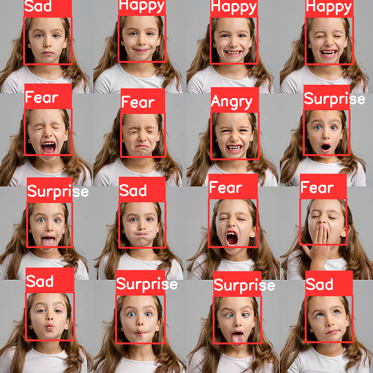

# Face Emotion Detection
This project is based on the face emotion detection with accuracy 78%,it levrages library's like opencv,tensorflow, kears etc. In this model I used Harss cascade algrothim, the model is trained on 35,000 images which is taken from Kaggle.
# how to run :
first we need to be in side the correct directory and then run "python test.py" file and click enter(this is for accessing real time image).

# Results:

